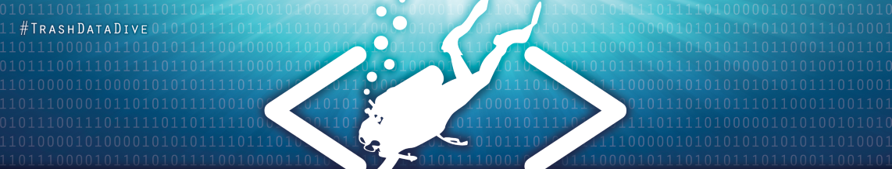
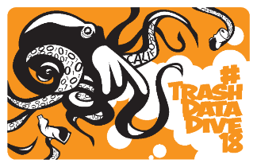

<!---## Trash Datathon Resources
This page provides links to efforts around the state and beyond to better understand and respond to the problem of trash pollution through:

- improved data collection methods/tools and data standards
- assessment and characterization of trash data to improve our understanding of the magnitude, distribition, and content of trash pollution (e.g., the magnitude and distribution of trash pollution across space and time, types of trash pollution and their relative magnitudes, etc.) 
- Use of trash data to analyze and/or predict the effects of trash pollution on environmental and public health--->

This page is a catalog of resources about available trash datasets, projects to improve trash data collection methods and standards, and analytical tools to summarize trash-related data and support assessment of the causes and impacts of trash pollution.

### Trash Data Collection and Classification Tools
- [CA Water Board's Trash Tracker Project](https://github.com/CAWaterBoardDataCenter/Trash-Tracker)
- [California Trash Monitoring Methods Project](https://sites.google.com/sfei.org/trash/)

### Trash Data Models
- [Collaborative Trash Data Model Development Project](https://github.com/CAWaterBoardDataCenter/TrashDataModel)

### Trash Datasets
- Placeholder

### Related Projects
- [Code for Sacramento's Litter Detection with Microsoft Custom Vision](https://github.com/walteryu/code4sac/tree/master/custom-vision)

### Previous Trash Datathon Projects
- [2018 Trash Data Dive Project Repositories](https://github.com/SCCWRP/2018TrashDataDive)
<!--- --->

